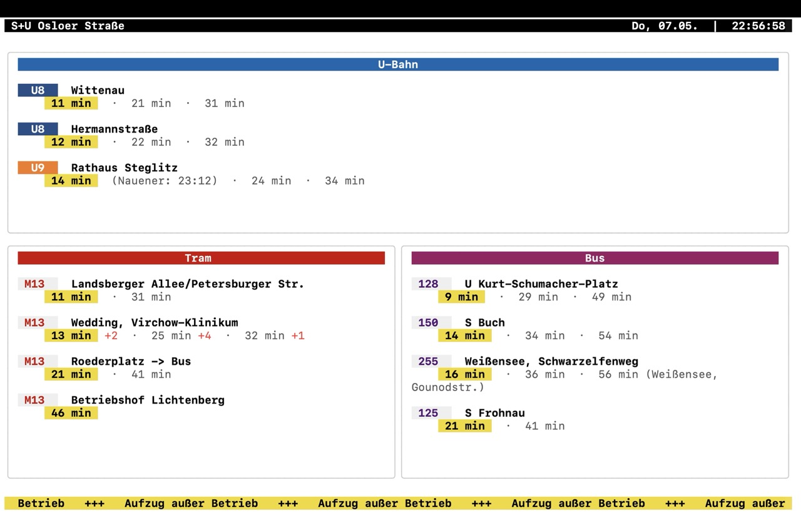

# BVG SmartScreen 🚇

A production-ready terminal dashboard for Berlin public transport (BVG), built with Go and the Bubble Tea framework.



## Features

- **2x2 Grid Layout**: Optimized display for U-Bahn, Trams, and Buses.
- **Smart Grouping (Kurzläufer)**: Automatically groups departures on the same route and highlights short-run trips (e.g., "bis S Frohnau").
- **Live Digital Clock**: Real-time localized clock in the header.
- **BVG Design System**: Precise line colors (U8, U9, etc.) and high-contrast terminal styling.
- **Dynamic Scrolling**: Automatically scrolls content if there are more departures than screen space.
- **Service Alerts**: Marquee footer showing real-time service disruptions.

## Tech Stack

- [Go](https://golang.org/)
- [Bubble Tea](https://github.com/charmbracelet/bubbletea) (v2)
- [Lip Gloss](https://github.com/charmbracelet/lipgloss) (v2)

## Installation

1. Clone the repository:
   ```bash
   git clone https://github.com/patmaeder/bvg-smartdisplay.git
   cd bvg-smartdisplay
   ```

2. Run the dashboard:
   ```bash
   go run ./
   ```

## Key Configuration

The dashboard is currently optimized for **U Osloer Straße** (`900009202`). You can change the `stationID` and `stationName` in `commands.go` to any BVG station.

## License

MIT
